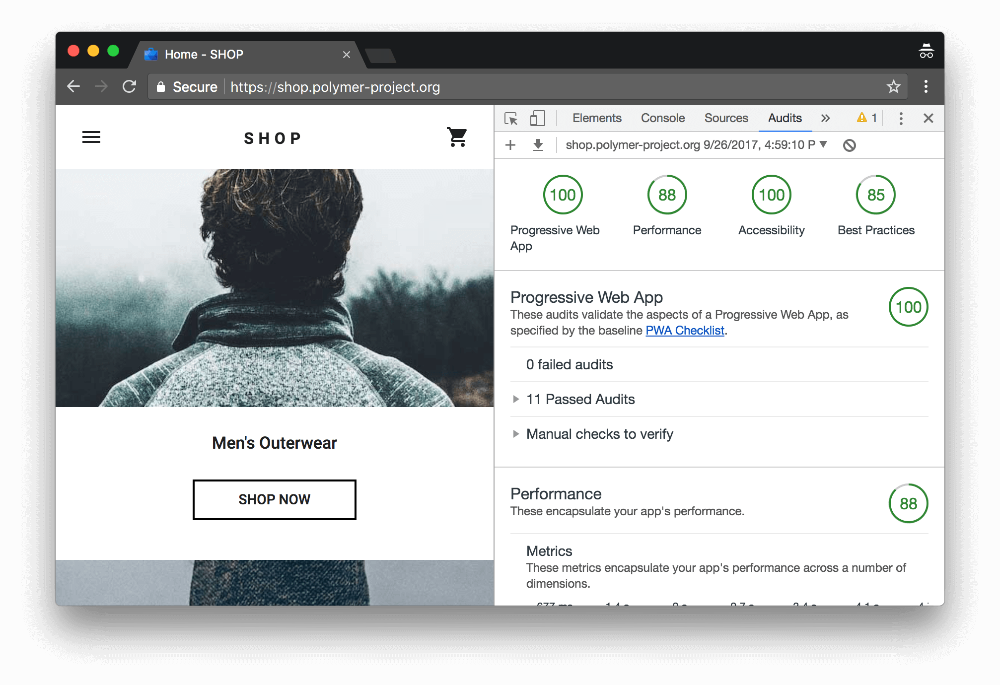

# Overview of Progressive Web Apps


**Finastra Digital Front-end Community Meetup #2, 2018-02-05**

*Andras Sevcsik <br> <andras.sevcsik@finastra.com> <br> Senior Software Engineer*

Questions: https://sli.do #1812

---

# Introduction

The term "Progressive Web Apps" does not refer to a single technology, but the philosophy of building web applications which offer a user experience comparable to navive applications.

According to [Google](https://developers.google.com/web/progressive-web-apps/):

> Progressive Web Apps are user experiences that have the reach of the web, and are:

> - **Reliable** - Load instantly and never show the downasaur, even in uncertain network conditions.
> - **Fast** - Respond quickly to user interactions with silky smooth animations and no janky scrolling.
> - **Engaging** - Feel like a natural app on the device, with an immersive user experience. 

---

# Why are native applications better?

## **They are fast**.
  - Static assets of a native application live on the device's storage. Only dynamic has to be downloaded.
  - Native GUI rendering is more efficient. It's much easier to achieve 60 fps animations with the GUI libraries native to the OS, than on the Web.

---

# Why are native applications better?

## **They are immersive**.
  - When you use an app, you don't see the browser around it. No URL bar, bookmarks, tabs. The whole experience revolves around only the app.
  - You don't have to open a browser to open an app, just tap an icon.

---

# Why are native applications better?

## **They are reliable**.
- Even without a connection, most apps can still function to some extent. When the connection is unstable, they usually work just a bit slower.

---

# Why are web applications better?

## **They are more visible**.
  - Web applications are visible not just to humans, but search engine crawlers, social networks and the semantic web (e.g. Google's Knowledge Graph).

---

# Why are web applications better?

## **They are accessible**.*
  - You don't have install anything to view a web app, just go to the URL. People can share content inside web apps with users who haven't used the app before.
  - Installing an app is a commitment, especially on low-end devices. One could decide against viewing content in your app because they need to install it.

\* *These concerns are getting addressed on Android, thanks to [Instant Apps](https://developer.android.com/topic/instant-apps/index.html)*

---

# Why are web applications better?

## **They are open**.
  - The web is built on open standards. When you build a web app, you build it for everyone based on a single platform.
  - As a developer, you have more control. You don't have to rely on the OS vendors' services and their infrastructure.

---

# History 

- [Mozilla Prism](https://en.wikipedia.org/wiki/Mozilla_Prism)
- [Chrome Applications](https://en.wikipedia.org/wiki/Google_Chrome#Desktop_shortcuts_and_apps) (and ChromeOS)
- [Firefox OS](https://en.wikipedia.org/wiki/Firefox_OS)
- [Electron](https://en.wikipedia.org/wiki/Electron_(software_framework)


---

# Add to home screen

Let the user to add an icon to the application launcher, which launches the application without a browser UI.

Supported browsers:
  - Chrome (desktop and Andorid), Firefox (Android only) (via [Web App Manifests](https://developer.mozilla.org/en-US/docs/Web/Manifest))
  - Safari on iOS (via [non-standard meta tag](https//developer.apple.com/library/content/documentation/AppleApplications/Reference/SafariHTMLRef/Articles/MetaTags.html))

---

# Add to home screen

.center[


]

Sources:
- https://developers.google.com/web/fundamentals/app-install-banners/
- https://www.youtube.com/watch?v=heSvwQgEMLM
- https://www.youtube.com/watch?v=IItoJX1PiLs

---

# Add to home screen

## Web App Manifest

A JSON descriptor which defines how the web app should behave when used as a PWA. Can be added to the application HTML using `<link>`.

It can describe the following:
  - Entry point URL
  - Title of the application (shown on the icon), icon files in different sizes
  - Theme color (e.g. the color of the status bar on Android)
  - Screen orientation
  - Visibility of browser UI elements
  - Splash screen (text on the splash screen, color)

**Hiding the browser UI works only HTTPS sites, as the user cannot see the security indicators if the browser UI is hidden.**

---

# Add to home screen

## Web App Manifest

```
{
  "short_name": "AirHorner",
  "name": "Kinlan's AirHorner of Infamy",
  "icons": [
    {
      "src": "launcher-icon-1x.png",
      "type": "image/png",
      "sizes": "48x48"
    },
    {
      "src": "launcher-icon-4x.png",
      "type": "image/png",
      "sizes": "192x192"
    }
  ],
  "start_url": "index.html?launcher=true"
}
```

---

# Add to home screen

## Web App Manifest

See more at:
  - https://developers.google.com/web/fundamentals/web-app-manifest/
  - https://developer.mozilla.org/en-US/docs/Web/Manifest
  - https://www.w3.org/TR/appmanifest/

---

# Add to home screen

## Web App Install Banner

[Chrome displays a banner](https://developers.google.com/web/fundamentals/app-install-banners/#what_are_the_criteria) to add the site to the home screen if:
  - `short_name`, `name`, `start_url` and a `192x192` icon is defined in the Web App Manifest
  - The site served over HTTPS
  - It has a service worker (more on that later)
  - Some other undisclosed "engagement heuristics"

Banners have a standard DOM API and they can be delayed, detected and cancelled.

It's also possible to prompt the user to install native Android apps if they're declared in the manifest.

---

# Add to home screen

## iOS meta tags

If the `apple-mobile-web-app-capable` meta tag is declared, and the app is added to the home screen, the app will launch without the browser UI.

The `app-mobile-web-app-status-bar-style` meta tag can be used to format the status bar when the app is open.

https://developer.apple.com/library/content/documentation/AppleApplications/Reference/SafariHTMLRef/Articles/MetaTags.html

---

# Publishing in the app store

A PWA can be published as a packaged app using a minimal native container, for example using [PhoneGap](https://phonegap.com/) or [Chrome Custom Tabs](https://developer.chrome.com/multidevice/android/customtabs).

Note that the package shouldn't contain any of your front-end assets, like a regular HTML-based application, but only a browser which loads the web application from your domain.

Such tool is [PWA Builder](http://www.pwabuilder.com/generator) which builds an Android or iOS package using the Web App Manifest of your application.

---

# Service Workers

A [Service Worker](https://developer.mozilla.org/en-US/docs/Web/API/Service_Worker_API) is a special [Web Worker](https://developer.mozilla.org/en-US/docs/Web/API/Worker) which can run in the background even if the browser window is closed.

As with Web Workers, they cannot interact directly with the DOM but can interact with the page using the `postMessage` API. As they run on a separate thread, they can use blocking I/O.

They act as a proxy between the origin and the UI thread, so they can intercept calls to the server.

Example uses:
 - Add offline capabilities by returning a cached response when the origin is not available
 - Synchronise online data with a local storage ([IndexedDB](https://developer.mozilla.org/en-US/docs/Web/API/IndexedDB_API)) so the user doesn't have to wait to fetch data on demand
 - Receive push notifications and display them using the [Notifications API](https://developer.mozilla.org/en-US/docs/Web/API/Notifications_API)
 - Geofencing, tracking, unsolicited cryptocurrency mining

---

# Service Workers

They can be registered from the main thread:

````
if ('serviceWorker' in navigator) {
  navigator.serviceWorker.register('/service-worker.js');
}
```

This will *install* the service worker to our page only once. Every subsequent visit to our page won't download and install the script again, but reuse it.

The browser will regularly check for updates in `service-worker.js` and replace it with a new version [in an appropriate moment](https://www.safaribooksonline.com/library/view/building-progressive-web/9781491961643/ch04.html).

---

# Service Workers

## Offline support and cache management

Once connected to a browser process, a Service Worker can listen to the `fetch` event and intercept HTTP requests. Using the [Cache API](https://developer.mozilla.org/en-US/docs/Web/API/Cache) it can respond with a file from the browser cache or forge a response on the client side.

---

# Service Workers

## Offline support and cache management

Example (from [Building Progressive Web Apps by Tal Ater](https://www.safaribooksonline.com/library/view/building-progressive-web/9781491961643/ch04.html)):

```
self.addEventListener("fetch", function(event) {
  event.respondWith(
    fetch(event.request).catch(function() {
      return caches.match(event.request).then(function(response) {
        return response ? response :
          event.request.headers.get("accept").includes("text/html") ? 
            caches.match("/index-offline.html") : null;
      });
    })
  );
});
```

---

# Service Workers

## Background sync

As the browser can kill/restart a service worker as it pleases, it's not feasible to maintain a HTTP longpolling/WebSocket connection which keeps the local database and the remote one in sync.

However, with the [Background Sync API](https://developers.google.com/web/updates/2015/12/background-sync) it's possible to wake up a SW periodically or when the device comes online.

For example, this makes it possible to keep a local IndexedDB synchronised with a remote CouchDB all the time [using PouchDB](https://medium.com/offline-camp/rethinking-offline-first-sync-for-service-workers-da4727b6dee).

---

# Service Workers

## Push notifications

Using the [Web Push API](https://developer.mozilla.org/en-US/docs/Web/API/Push_API), a SW can listen to events from a vendor-specific push service, such as Google Cloud Messaging, Mozilla Push Service or Windows Push Notification Services.

These notifications can be used to trigger visible notifications or initiate a background sync (instead of polling).

---

# Lighthouse

[Lighthouse](https://developers.google.com/web/tools/lighthouse/) is a development tool from Google which performs static and dynamic analysis on your application and generates reports about performance and accessibility issues, PWA-readyness and some best practices for your app.

It can be used as a Chrome extension or wired in your CI pipeline as a Node.js module.



---

# Thanks for listening!


Questions: https://sli.do #1812


