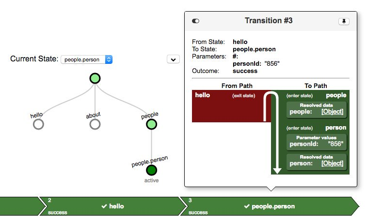

# Routing in AngularJS with UI-Router


**Finastra Digital Front-end Community Meetup #1, 2017-12-04**

*Andras Sevcsik <br> <andras.sevcsik@finastra.com> <br> Senior Software Engineer*

Questions: https://sli.do #5547

---

## Structure of a URI

```
|  https:  | //myapp.example.com | /app |   ?lang=en   |  #contact   |
+----------+---------------------+------+--------------+-------------+
| protocol |        host         | path | query string | fragment ID |
```

The [fragment identifier] identifies an part of the resource.

In case of HTML:
 - The fragment ID is never sent to the server
 - The browser renders the DOM and scrolls to the element with the given ID
 - Navigating between different fragments in the same document doesn't reload the page

[Other uses] of fragment IDs:
 - Go to a given time in a video file: <br>
   `http://example.com/foo.mp4#t=10,20`
 - Reference only a given shape in an SVG file ([sprites]): <br>
   ``

---

## Client-side routing using the URI

Why?
 - The user can share/bookmark various states of the application
 - Navigation will be recorded in the browser's history, so back/forward buttons will work as expected
 - Helps to avoid spaghetti code: different routes are encapsulated as the global state is shared via the router

How?
 - A dynamic routing library can override the default browser behaviour using the [History Web API]
 - Fragment IDs can be avoided to have 'friendly' URLs with server support (URL rewriting)<br>
   `http://myapp.example.com/app/en/contact`

---

## The dream of statelessness

*"I have a dream that my four little children will one day develop UIs without worrying about inconsistent state."*
~ Martin Luther King Jr.

Everyone wants to be stateless.

- It's impossible to reach an inconsistent state in stateless environment
- Every operation is reproducible by fixed set of arguments: pureness, the cornerstone of functional programming
- Debugging is trivial (and rarely necessary)
- Unit testing is easy: no need to replay scenarios in test cases

Unfortunately our users are stateful.

- You can **never** eliminate state
- Alas, people think sequentially, thus our user journeys are stateful

What you can do however, is burying stateful behaviour as far as possible, ideally to code you don't have to maintain.

---

## [UI-Router]

- Available for AngularJS, Angular and React
- Uses hierarchical routing
- Supports both fragment-based and friendly URLs
- Much more than a router
  - Manages the application state
  - Manages the lifecycle of components
  - Has an asynchronous, hierarchical dependency injector
  - Provides [a visualiser tool]

.center[]

---

## States

- The entire application is a hierarchical [state machine]
- Each state
  - Must have a name (nesting is expressed with a `.` (dot) separator)
  - Might have parameters
  - Might have asynchronous dependencies (`resolve`)
  - Might have a view (either a component or a controller + template)
  - Might have a URL

---

## Declaring states

```js
const findProducts = ProductService => ProductService.findAll()
const filterProducts = (products, $transition$) =>
	products.filter(p => 
		p.name.includes($transition$.params().keyword))
const findProductById (products, $stateParams) =>
	products.find(p => p.id === $stateParams.id)
module('app', ['ui.router']).config($stateProvider => {
	$stateProvider
		.state({ name: 'products'
		       , url: '/products',
		       , component: 'productSearchForm'
		       , resolve: { products: findProducts } })
		.state({ name: 'products.search'
		       , url: '/search/{keyword}'
		       , component: 'productSearchResults'
		       , resolve: { results: filterProducts } })
		.state({ name: 'products.view'
		       , url: '/view/{id}'
		       , controller: 'ProductViewController'
		       , template: '<h1>{{ product.name }}</h1>'
		                 + '<other-products products="others">'
		       , resolve: { product: findProducyById } })
})
```

---

## Views

.center[]

---

## Transitioning between states

HTML links:
```html
<a ui-sref=".view({ id: 5 })">Product #5</a>
```

JavaScript:
```js
module('app').component('productSearchForm', {
	controller: class ProductSearchFormController {
		constructor($state) {
			this._$state = $state
			this.keyword = null // <- ng-model
		}
		doSearch() {
			this._$state.go('.search', {
				params: { keyword: this.keyword }
			})
		}
	}
}
```

---

## Dependency injection into components

```js
module('app').component('productSearchResults', {
	bindings: {
		results: '<'
	},
	template: `
		<a ng-repeat="p in $ctrl.results"
		   ui-sref="^.view({ id: p.id })">
			{{ product.name }}
		</a>
	`
})
```

- If `results` would be a promise, the component would be only rendered if the promise is resolved.
- The resolved results are bound to the component's controller via attribute binding.

---

## Dependency injection into controllers

```js
module('app').controller('ProductViewController', class {
	constructor(product, products, $scope) {
		$scope.product = product
		$scope.others =
			_.take(_.filter(products, p => p.id !== product.id), 3)
	}
})
```

- If `products` would be a promise, the controller would be only isntantiated if the promise is resolved.
- The resolved products can be injected into the controller's constructor
- The parent state's dependencies (`products`) can also be injected

---

## Summary


UI-Router is good for you!

- State can be encapsulated into it - if done right, the state provider will be the single source of truth
- Controllers can be fully stateless
- Trivial to implement loading screens using `resolve`
- Users will love you for shareable URLs

Questions: https://sli.do #5547

[fragment identifier]: https://en.wikipedia.org/wiki/Fragment_identifier
[Other uses]: https://en.wikipedia.org/wiki/Fragment_identifier#Examples
[sprites]: https://css-tricks.com/svg-fragment-identifiers-work/
[History Web API]: https://developer.mozilla.org/en-US/docs/Web/API/History_API
[URL rewriting]: https://en.wikipedia.org/wiki/Rewrite_engine
[UI-Router]: https://ui-router.github.io/
[a visualiser tool]: https://github.com/ui-router/visualizer
[state machine]: https://en.wikipedia.org/wiki/state_machine
